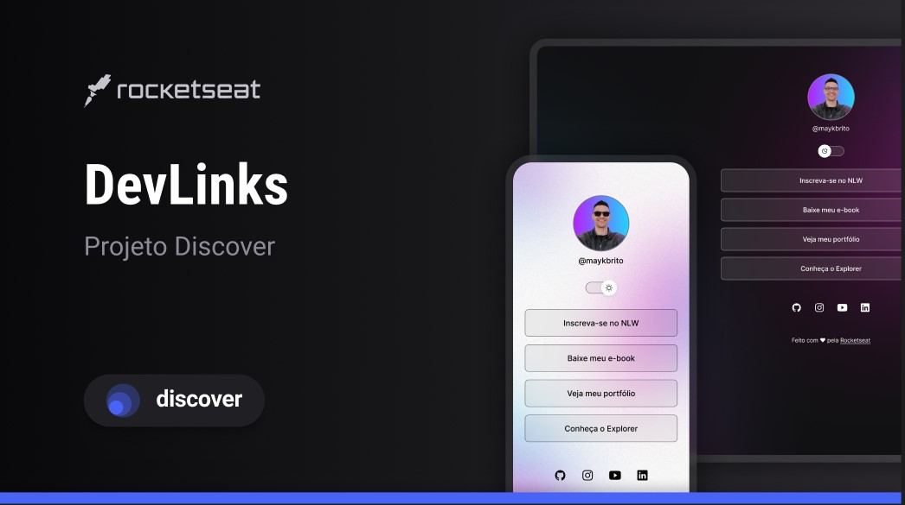
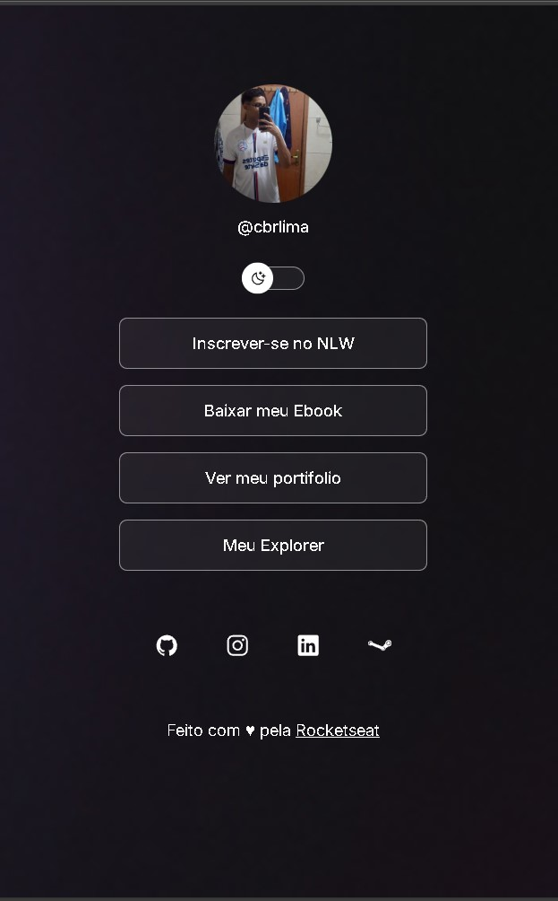
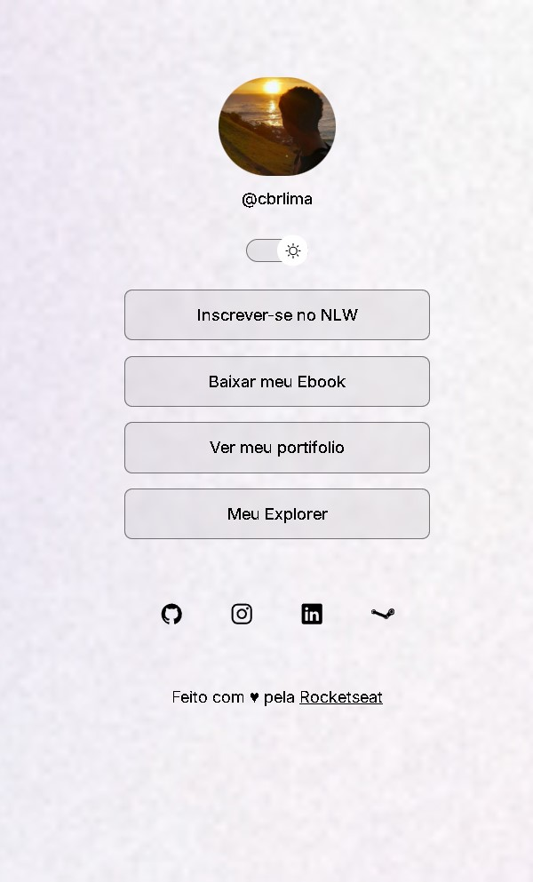
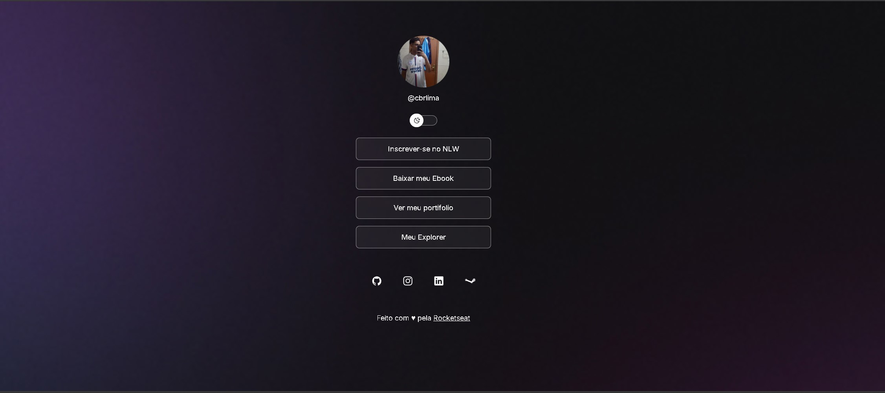
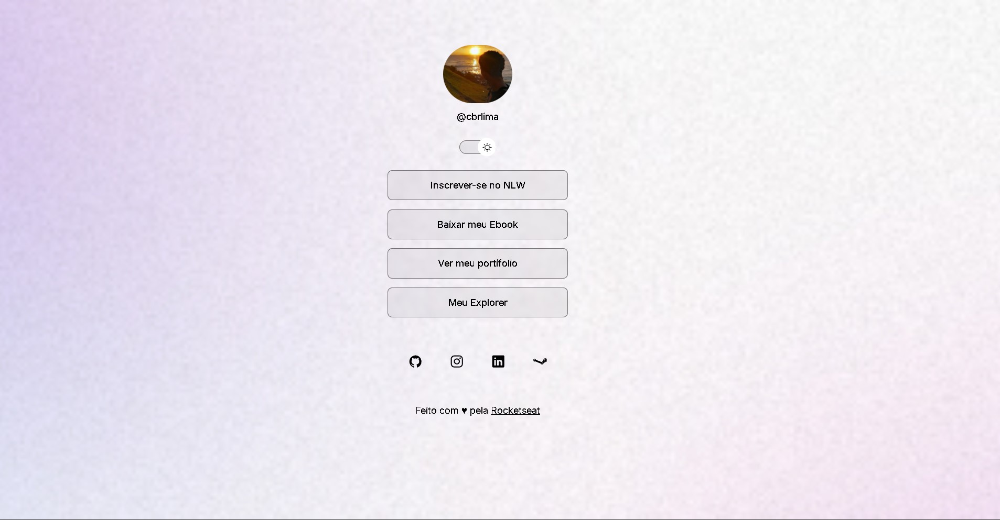

<h1 align="center">Dev Links</h1>

Programa exclusivo e gratuito, promovido pela Rocketseat para ensino de tecnologias WEB.

  <a href="#-tecnologias">Tecnologias</a>&nbsp;&nbsp;&nbsp;|&nbsp;&nbsp;&nbsp;
  <a href="#-projeto">Projeto</a>&nbsp;&nbsp;&nbsp;|&nbsp;&nbsp;&nbsp;
  <a href="#-layout">Layout</a>&nbsp;&nbsp;&nbsp;|&nbsp;&nbsp;&nbsp;
  <a href="#memo-licença">Licença</a>

  

 

  

## 🚀 Tecnologias

Esse projeto foi desenvolvido com as seguintes tecnologias:

- HTML e CSS
- JavaScript
- Git e Github
- Figma

## 💻 Projeto

O DevLinks é um agrefador de links para usdar como capa de visitas online

## Layout

Pode visualizar o layout do projeto neste link (https://www.figma.com/design/PmXW7i3yBK3EnEfyDX9OEf/DevLinks-%E2%80%A2-Projeto-Discover--Community-?node-id=10-620&p=f&t=u95OuSlXW2OR6HQq-0)

## 💻 Telas

  
  

  

  

## Licença

Esse projeto esta sob a licença MIT.

---

Feito com ♥ by Rocketseat :wave: [Participe da nossa comunidade!](https://discord.gg/rocketseat)# Devlinks-Projeto
# Devlinks-Projeto
